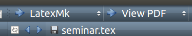

Software Tools
================

Texmaker
-----------

A useful program to use LaTeX on Ubuntu.

.. warning:: make sure that you play with the build option if it is saying that the references where not found.

For instance, after a while this worked:

.. image:: build.png

Then, the above option did not work and this worked:

